# Terminus 项目 AI 上下文文档

> 最后更新时间: 2025-12-26 15:37:13
> 项目版本: 2.3.0-beta3
> 扫描覆盖率: 约 75%

---

## 变更记录 (Changelog)

| 时间 | 变更内容 |
|------|----------|
| 2025-12-26 15:37:13 | 初始化项目 AI 上下文，生成根级与模块级文档索引 |

---

## 项目愿景

**Terminus (毕昇)** 是一个开源的 LLM 应用开发运维平台，专注于企业级应用场景。项目名称来源于活字印刷术发明家毕昇，寓意通过智能化技术推动知识的广泛传播。

### 核心特性

1. **Linsight - 通用型智能体**：通过 AGL (Agent Guidance Language) 框架，将领域专家的偏好、经验和业务逻辑嵌入 AI，使智能体在处理任务时展现"专家级理解"

2. **Terminus Workflow 工作流引擎**：
   - 独立完整的应用编排框架
   - 支持人机协同 (Human in the Loop)
   - 支持循环、并行、批处理、条件逻辑
   - 直观的可视化流程图操作

3. **企业应用设计**：文档审阅、固定布局报告生成、多智能体协作、政策更新对比、工单辅助、客服辅助、会议纪要生成、简历筛选、通话记录分析等

4. **企业级功能**：安全审计、RBAC、用户组管理、流量控制、SSO/LDAP、漏洞扫描、高可用部署

5. **高精度文档解析**：包含高精度印刷体、手写体、生僻字识别、表格识别、版面分析、印章识别等模型

---

## 架构总览

### 技术栈

| 层级 | 技术选型 |
|------|----------|
| **后端** | Python 3.10+ / FastAPI / LangChain / LangGraph |
| **前端** | React 18 / TypeScript / Vite / TailwindCSS |
| **数据库** | MySQL 8.0 / Redis 7.0 |
| **向量存储** | Milvus 2.5 / Elasticsearch 8.12 |
| **对象存储** | MinIO |
| **消息队列** | Celery + Redis |
| **容器化** | Docker / Docker Compose |

### 系统架构

```
                        +-------------------+
                        |   Nginx (3001)    |
                        +-------------------+
                                 |
                +----------------+----------------+
                |                                 |
        +-------+-------+                 +-------+-------+
        |  Frontend     |                 |  Backend API  |
        |  (Client)     |                 |  (FastAPI)    |
        |  React/TS     |                 |  Port: 7860   |
        +---------------+                 +-------+-------+
                                                |
        +---------------+---------------+---------------+---------------+
        |               |               |               |               |
+-------+-------+ +-----+-------+ +-----+-------+ +-----+-------+ +-----+-------+
|  Backend      | |  Backend    | |  MySQL      | |  Redis      | |  Milvus     |
|  Worker       | |  Services   | |  3306       | |  6379       | |  19530      |
|  (Celery)     | |             | |             | |             | |             |
+---------------+ +-------------+ +-------------+ +-------------+ +-------------+
        |               |               |               |               |
+-------+---------------+---------------+---------------+---------------+
        |               |               |               |               |
+-------+-------+ +-----+-------+ +-----+-------+ +-----+-------+ +-----+-------+
|  Elasticsearch | |  MinIO     | |  LangChain  | |  LangGraph  | |  terminus    |
|  9200          | |  9000/9001 | |             | |             | |  _langchain |
+----------------+ +------------+ +-------------+ +-------------+ +-------------+
```

---

## 模块结构图

```mermaid
graph TD
    ROOT["(根) terminus"] --> SRC["src"];
    SRC --> BACKEND["backend"];
    SRC --> FRONTEND["frontend"];

    BACKEND --> Terminus["terminus"];
    BACKEND --> BISHENG_LANGCHAIN["bisheng_langchain"];

    Terminus --> API["api"];
    Terminus --> CHAT["chat"];
    Terminus --> CORE["core"];
    Terminus --> DATABASE["database"];
    Terminus --> SERVICES["services"];
    Terminus --> WORKER["worker"];
    Terminus --> COMMON["common"];
    Terminus --> KNOWLEDGE["knowledge"];
    Terminus --> LLM["llm"];
    Terminus --> TOOL["tool"];
    Terminus --> USER["user"];
    Terminus --> FINETUNE["finetune"];
    Terminus --> CHAT_SESSION["chat_session"];

    BISHENG_LANGCHAIN --> AGENTS["agents"];
    BISHENG_LANGCHAIN --> CHAINS["chains"];
    BISHENG_LANGCHAIN --> CHAT_MODELS["chat_models"];
    BISHENG_LANGCHAIN --> DOCUMENT_LOADERS["document_loaders"];
    BISHENG_LANGCHAIN --> EMBEDDINGS["embeddings"];
    BISHENG_LANGCHAIN --> GPTS["gpts"];
    BISHENG_LANGCHAIN --> RAG["rag"];

    FRONTEND --> CLIENT["client"];
    FRONTEND --> PLATFORM["platform"];

    CLIENT --> PAGES["pages"];
    CLIENT --> COMPONENTS["components"];
    CLIENT --> PROVIDERS["Providers"];
    CLIENT --> CONTEXTS["contexts"];

    PLATFORM --> CUSTOM_NODES["CustomNodes"];
    PLATFORM --> TYPED_FIELD["typedField"];
    PLATFORM --> NODES["nodes"];

    ROOT --> DOCKER["docker"];
    ROOT --> GITHUB["github"];

    click BACKEND "./src/backend/CLAUDE.md" "查看后端模块文档"
    click FRONTEND "./src/frontend/CLAUDE.md" "查看前端模块文档"
    click DOCKER "./docker/CLAUDE.md" "查看 Docker 配置"
```



---

## 模块索引

| 模块路径 | 职责描述 | 语言 | 入口文件 | 文档链接 |
|----------|----------|------|----------|----------|
| `src/backend/terminus` | 核心后端服务，FastAPI 应用主入口 | Python | `main.py` | [详情](./src/backend/CLAUDE.md) |
| `src/backend/bisheng_langchain` | LangChain 扩展与集成，包含 Agent、Chain、RAG 等实现 | Python | - | [详情](./src/backend/bCLAUDE.md) |
| `src/frontend/client` | 客户端前端应用，用户聊天界面 | TypeScript/React | `src/App.tsx` | [详情](./src/frontend/CLAUDE.md) |
| `src/frontend/platform` | 平台管理前端，工作流可视化编辑器 | TypeScript/React | `src/index.tsx` | [详情](./src/frontend/CLAUDE.md) |
| `docker` | Docker 容器编排配置 | YAML | `docker-compose.yml` | [详情](./docker/CLAUDE.md) |

---

## 运行与开发

### 环境要求

- CPU >= 4 核
- RAM >= 16 GB
- Docker 19.03.9+
- Docker Compose 1.25.1+
- 推荐配置: 18 核 48G

### 快速启动

```bash
# 克隆仓库
git clone https://github.com/dataelement/bisheng.git
cd terminus/docker

# 启动服务
docker compose -f docker-compose.yml -p terminus up -d

# 访问地址
http://IP:3001
```

### 开发模式启动

**后端开发:**
```bash
cd src/backend
# 安装依赖
pip install -e .
# 启动 API 服务
python -m terminus.main
# 或启动 Worker
python -m terminus.worker.main
```

**前端开发 (Client):**
```bash
cd src/frontend/client
npm install
npm run start  # 开发模式
npm run build  # 生产构建
```

**前端开发 (Platform):**
```bash
cd src/frontend/platform
npm install
npm run start  # 开发模式
npm run build  # 生产构建
```

---

## 测试策略

### 后端测试

- 测试目录: `src/backend/test/`
- 测试文件: `test_*.py`
- 主要测试覆盖:
  - API 测试 (`test_api.py`)
  - 文档处理测试 (`test_docx.py`)
  - Elasticsearch 测试 (`test_es.py`)
  - GPTs 测试 (`test_gpts.py`)
  - LLM 测试 (`test_llm.py`)
  - WebSocket 测试 (`test_ws.py`)

### 前端测试

- 测试框架: Jest + React Testing Library
- 测试文件: `**/__tests__/**/*.spec.tsx`
- 覆盖: 组件测试、路由测试

---

## 编码规范

### Python 后端

- 使用 FastAPI 异步框架
- 遵循 PEP 8 规范
- 使用 Pydantic 进行数据验证
- 使用 Alembic 进行数据库迁移
- 使用 Loguru 进行日志记录

### TypeScript 前端

- 使用 TypeScript 5.x
- 使用 React 18 + Hooks
- 使用 TailwindCSS 进行样式
- 使用 Recoil/React-Query 进行状态管理
- 使用 React Router v6 进行路由

---

## AI 使用指引

### 项目结构导航

1. **API 路由定义**: `src/backend/terminus/api/v1/`
2. **服务层逻辑**: `src/backend/terminus/api/services/`
3. **数据库模型**: `src/backend/terminus/database/models/`
4. **工作流处理**: `src/backend/terminus/processing/`
5. **LangChain 集成**: `src/backend/bisheng_langchain/`

### 关键概念

- **Flow/Workflow**: 可视化工作流，由多个节点组成
- **Agent/Assistant**: 智能体，基于 LLM 的对话助手
- **Knowledge**: 知识库，支持多种文档格式的向量化存储
- **Component**: 组件，工作流中的可复用单元
- **Skill**: 技能，封装的 AI 能力

### 常见任务

- **添加新的 API 端点**: 在 `src/backend/terminus/api/v1/` 创建路由文件
- **添加新的工作流节点**: 在 `src/backend/terminus/interface/` 定义节点类型
- **修改前端页面**: 在 `src/frontend/` 对应模块下编辑组件
- **数据库迁移**: 使用 Alembic `src/backend/terminus/core/database/alembic/`

---

## 依赖关系

### 外部服务依赖

| 服务 | 用途 | 端口 |
|------|------|------|
| MySQL | 关系数据库 | 3306 |
| Redis | 缓存/消息队列 | 6379 |
| Milvus | 向量数据库 | 19530 |
| Elasticsearch | 全文检索 | 9200 |
| MinIO | 对象存储 | 9000/9001 |

### 核心 Python 依赖

- FastAPI >= 0.120.4
- LangChain >= 0.3.23
- LangGraph >= 0.3.27
- SQLAlchemy / SQLModel
- Alembic >= 1.17.1
- Celery >= 5.5.3

### 核心 Node 依赖

- React 18.3.1
- TypeScript 5.x
- Vite 6.x
- TailwindCSS 3.4+
- @xyflow/react (流程图组件)

---

## 项目特色

### Terminus Workflow 独特优势

1. **统一编排框架**: 在单一框架内执行各种任务
2. **人机协同**: 工作流执行过程中可进行用户干预和反馈
3. **强大功能**: 支持循环、并行、批处理、条件逻辑
4. **直观操作**: 循环即画圈、并行即对齐、批量即多选

### Linsight 智能体

基于 AGL (Agent Guidance Language) 框架，将领域专家知识嵌入 AI，实现专家级任务理解能力。

---

## 扫描覆盖率说明

本次扫描覆盖以下内容:

- **已扫描**:
  - 主要 Python 源代码文件
  - 主要 TypeScript/React 源代码文件
  - Docker 配置文件
  - API 路由定义
  - 测试文件

- **未完全扫描**:
  - 部分前端组件文件 (数量庞大)
  - 部分第三方库集成代码
  - 配置 YAML 文件详细内容

- **建议补充扫描**:
  - `src/frontend/platform/src/pages/` - 平台前端页面详情
  - `src/backend/terminus/interface/` - 自定义组件接口定义
  - `src/backend/terminus/processing/` - 工作流处理逻辑

---

## 下一步建议

1. 深入阅读关键模块的详细文档 (点击上方模块结构图中的链接)
2. 查看 Docker 配置了解部署架构
3. 参考 API 路由文档了解接口定义
4. 运行测试用例了解项目功能

---

**文档生成时间**: 2025-12-26 15:37:13
**项目版本**: 2.3.0-beta3
**扫描工具**: Claude Code Architect
